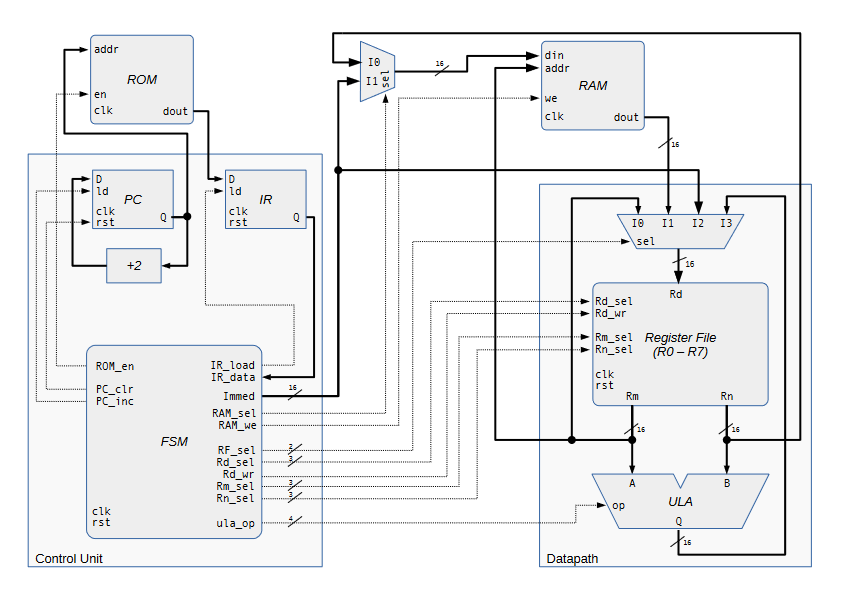
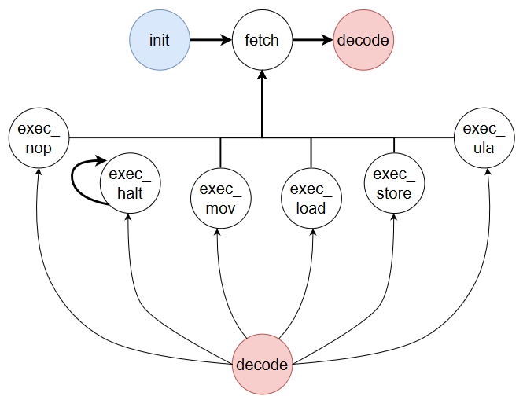

# 16-Bit VHDL Processor



## Description

This repository contains a 16-bit processor implemented in VHDL using Vivado. The processor was developed as a project for the Digital Systems course taught by Professor Thiago Werlley at [UFC Campus Quixadá](https://www.quixada.ufc.br/).

## Features

- 16-bit architecture
- Single-cycle execution
- Basic arithmetic and logical operations
- Memory access instructions
- Instruction set includes ADD, SUB, AND, OR, LOAD, STORE, and more.

## Project Structure

```
design/                  # Vivado project sources
├── 16bits_cpu/          
│   ├── 16bits_cpu.sim   # Vivado logs
│   ├── 16bits_cpu.srcs  # .vhd files
│   └── 16bits_cpu.xpr   # Vivado project
docs/                    # Project documentation
resources/               # Project resources
README.md                # Project resume (you are here)
```

## Getting Started

1. Clone the repository:

```
git clone https://github.com/your-username/16-bit-processor.git
```

2. Open Vivado and create a new project.

3. Add the VHDL source files to the project.

4. Synthesize and implement the design.

5. Generate a bitstream and program the FPGA.

## Instruction Set

```markdown
| INSTRUCTION    | OPERATION       | TYPE  | 15 14 13 12 | 11 | 10  9   8   7   6   5   4   3   2   1   0   |
|----------------|-----------------|-------|-------------|----|---------------------------------------------|
| NOP            | nop             | NOP   | 0  0  0  0  | 0  | 0   0   0   0   0   0   0   0   0   0   0   |
| HALT           | halt            | HALT  | 1  1  1  1  | 1  | 1   1   1   1   1   1   1   1   1   1   1   |
| MOV Rd, Rm     | Rd = Rm         | MOV   | 0  0  0  1  | 0  | Rd2 Rd1 Rd0 Rm2 Rm1 Rm0 -   -   -   -   -   |
| MOV Rd, #Im    | Rd = #Im        | MOV   | 0  0  0  1  | 1  | Rd2 Rd1 Rd0 Im7 Im6 Im5 Im4 Im3 Im2 Im1 Im0 |
| STR [Rm], Rn   | [Rm] = Rn       | STORE | 0  0  1  0  | 0  | -   -   -   Rm2 Rm1 Rm0 Rn2 Rn1 Rn0 -   -   |
| STR [Rm], #Im  | [Rm] = #Im      | STORE | 0  0  1  0  | 1  | Im7 Im6 Im5 Rm2 Rm1 Rm0 Im4 Im3 Im2 Im1 Im0 |
| LDR Rd, [Rm]   | Rd = [Rm]       | LOAD  | 0  0  1  1  | -  | Rd2 Rd1 Rd0 Rm2 Rm1 Rm0 -   -   -   -   -   |
| ADD Rd, Rm, Rn | Rd = Rm + Rn    |  ALU  | 0  1  0  0  | -  | Rd2 Rd1 Rd0 Rm2 Rm1 Rm0 Rn2 Rn1 Rn0 -   -   |
| SUB Rd, Rm, Rn | Rd = Rm - Rn    |  ALU  | 0  1  0  1  | -  | Rd2 Rd1 Rd0 Rm2 Rm1 Rm0 Rn2 Rn1 Rn0 -   -   |
| MUL Rd, Rm, Rn | Rd = Rm * Rn    |  ALU  | 0  1  1  0  | -  | Rd2 Rd1 Rd0 Rm2 Rm1 Rm0 Rn2 Rn1 Rn0 -   -   |
| AND Rd, Rm, Rn | Rd = Rm and Rn  |  ALU  | 0  1  1  1  | -  | Rd2 Rd1 Rd0 Rm2 Rm1 Rm0 Rn2 Rn1 Rn0 -   -   |
| ORR Rd, Rm, Rn | Rd = Rm or Rn   |  ALU  | 1  0  0  0  | -  | Rd2 Rd1 Rd0 Rm2 Rm1 Rm0 Rn2 Rn1 Rn0 -   -   |
| NOT Rd, Rm     | Rd = ¬Rm        |  ALU  | 1  0  0  1  | -  | Rd2 Rd1 Rd0 Rm2 Rm1 Rm0 -   -   -   -   -   |
| XOR Rd, Rm, Rn | Rd = Rm xor Rn  |  ALU  | 1  0  1  0  | -  | Rd2 Rd1 Rd0 Rm2 Rm1 Rm0 Rn2 Rn1 Rn0 -   -   |
```

The processor supports a simple instruction set with basic arithmetic, logical, and memory access operations. For a detailed list of supported instructions, please refer to the [instructions_1.pdf](docs/instructions_1.pdf) and [instructions_2.pdf](docs/instructions_2.pdf) files.

## Finite State Machine (FSM)



The processor utilizes a finite state machine for its control unit. The FSM diagram is shown below:

| signal  |        |  0000   |   0001   |   0011    |   0100   |   0101    |    0110    |   0111   |
|---------|--------|---------|----------|-----------|----------|-----------|------------|----------|
| states  |  init  |  fetch  |  decode  | exec_halt | exec_mov | exec_load | exec_store | exec_ula |
| PC_clr  |    1   |    0    |     0    |     -     |     -    |     -     |     -      |    -     |
| PC_inc  |    0   |    1    |     0    |     -     |     -    |     -     |     -      |    -     |
| ROM_en  |    0   |    1    |     0    |     -     |     -    |     -     |     -      |    -     |
| IR_ld   |    0   |    1    |     0    |     -     |     -    |     -     |     -      |    -     |
| Immed   | x”0000”| x”0000” |  x”0000” |     -     |     -    |     -     |     -      |    -     |
| RAM_sel |    0   |    0    |     0    |     -     |     -    |     -     |     -      |    -     |
| RAM_we  |    0   |    0    |     0    |     -     |     -    |     -     |     1      |    -     |
| RF_sel  |   00   |   00    |    00    |     -     |  10 / 00 |    01     |     -      |    11    |
| Rd_sel  |   000  |   000   |    000   |     -     |     -    |     -     |     -      |    -     |
| Rd_wr   |    0   |    0    |     0    |     -     |     1    |     1     |     -      |    1     |
| Rm_sel  |   000  |   000   |    000   |     -     |     -    |     -     |     -      |    -     |
| Rn_sel  |   000  |   000   |    000   |     -     |     -    |     -     |     -      |    -     |
| ula_op  |  0000  |  0000   |   0000   |     -     |     -    |     -     |     -      |    -     |


|          | RF_sel |                    |      -      |            | RAM_sel |                    |
|----------|--------|--------------------|      -      |------------|---------|--------------------|
| exec_mov |   10   | Rd = x”00” + immed |      -      | exec_store |    1    | Rm = x”00” + immed |
|          |   00   | Rd = Rm_sel        |      -      |            |    0    | Rm = Rn_sel        |

For a better view, go to pdf files on docs folder:
[FSM Diagram](docs/fsm_table.pdf)

## Documentation

Detailed documentation and schematics of the processor can be found in the [docs](docs) folder.

## Results

The processor has been tested using the provided testbench and verified to produce correct results for various instructions.

[You can see some testbenchs here](docs/pics/)

## License

This project is licensed under the MIT License - see the [LICENSE](LICENSE) file for details.

## Acknowledgments

Special thanks to Professor Thiago Werlley for the guidance and support throughout this project.

## Contact

For any inquiries or questions, please contact:

[Ryan Guilherme](https://github.com/ryanguilherme)\
Email: ryanguilhermetbt@gmail.com

---